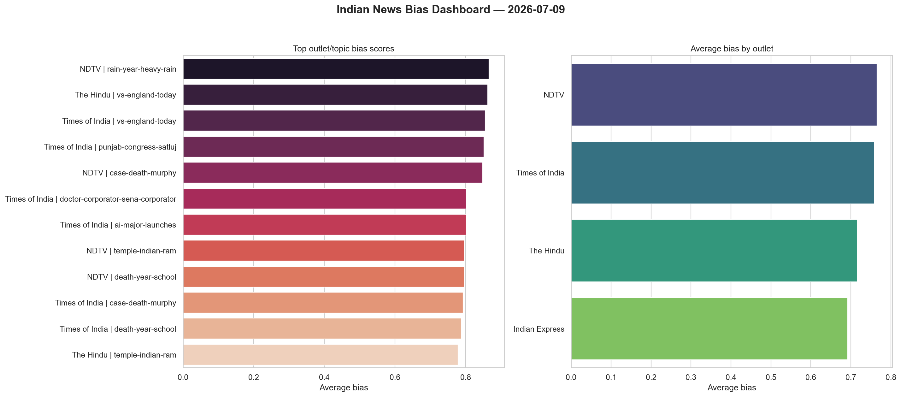

# 🗞️ Indian News Bias Analyzer


> An automated NLP pipeline that ingests live RSS feeds from 4 major Indian news outlets, clusters articles by topic using TF-IDF + KMeans, scores sentiment and bias with VADER, and surfaces how different outlets frame the **same** story — with a new report committed to this repo every day.

---

## 📌 Table of contents

- [Project overview](#project-overview)
- [Architecture](#architecture)
- [Sample findings](#sample-findings)
- [Project structure](#project-structure)
- [Setup & installation](#setup--installation)
- [How to run](#how-to-run)
- [How to commit to GitHub](#how-to-commit-to-github)
- [Daily report automation](#daily-report-automation)
- [Database schema](#database-schema)
- [Tech stack](#tech-stack)

---

## Project overview

Four major Indian news outlets — **Times of India**, **NDTV**, **The Hindu**, and **Indian Express** — often cover the same political or national event with completely different framing, vocabulary, and emotional tone. This project makes that difference measurable.

**What it does:**

1. **Ingests** live RSS feeds from all 4 sources every 6 hours into a SQLite database
2. **Clusters** articles by topic using TF-IDF vectorisation + KMeans — grouping stories about the same event across outlets
3. **Scores** each article with VADER sentiment and a custom bias score: `bias = abs(sentiment) × (1 + loaded_word_ratio)`
4. **Analyses** keyword divergence between outlets on the same topic cluster
5. **Visualises** findings in a 4-panel dashboard — sentiment heatmap, word clouds, bias rankings
6. **Commits** a fresh markdown report to this repository every morning automatically

**CV headline:** *"Built a live NLP pipeline ingesting 4 Indian news RSS feeds into SQLite, applying TF-IDF + KMeans clustering and VADER sentiment scoring to quantify media framing differences across outlets — with automated daily reports committed to GitHub."*

---

## Architecture

```
RSS Feeds (4 sources)
        │
        ▼
01_ingest.py  ──────────────►  data/news_bias.db
    feedparser + schedule           │
                                    │
        ┌───────────────────────────┤
        │                           │
        ▼                           ▼
02_cluster.py              03_sentiment.py
TF-IDF + KMeans            VADER + bias score
topic_cluster label    sentiment_score, bias_score
        │                           │
        └───────────┬───────────────┘
                    │
                    ▼
            04_framing.py
        keyword overlap analysis
        outputs/framing_analysis.json
                    │
                    ▼
            07_dashboard.py
        outputs/bias_dashboard.png
                    │
                    ▼
            06_report.py
        reports/YYYY-MM-DD.md
        auto-committed to GitHub
```

---

## Sample findings

*Based on live data collected on 2026-07-09. New findings are added daily in the `reports/` folder.*

### Bias scores by outlet and topic

| Source | Topic | Avg Sentiment | Avg Bias | Articles |
|---|---|---|---|---|
| NDTV | rain-year-heavy-rain | −0.83 | **+0.87** | 1 |
| The Hindu | vs-england-today | −0.86 | **+0.86** | 1 |
| Times of India | vs-england-today | +0.86 | **+0.86** | 2 |
| Times of India | punjab-congress-satluj | +0.85 | **+0.85** | 1 |
| NDTV | case-death-murphy | −0.85 | **+0.85** | 1 |
| Times of India | ai-major-launches | +0.80 | **+0.80** | 1 |
| NDTV | temple-indian-ram | −0.80 | **+0.80** | 4 |
| Times of India | case-death-murphy | −0.15 | +0.79 | 5 |

### Key insight

On the `vs-england-today` topic cluster (India vs England cricket), **Times of India** scored sentiment **+0.86** (positive framing) while **The Hindu** scored **−0.86** (negative framing) — opposite emotional tone on the identical story. This is the bias signal the project is designed to surface.

### Dashboard



---

## Project structure

```
indian-news-bias-analyzer/
│
├── src/
│   ├── common.py          # shared DB connection, config, helpers
│   ├── 01_ingest.py       # RSS ingestion → SQLite
│   ├── 02_cluster.py      # TF-IDF + KMeans topic clustering
│   ├── 03_sentiment.py    # VADER sentiment + bias scoring
│   ├── 04_framing.py      # keyword divergence analysis
│   ├── 05_viz.ipynb       # EDA + visualisation notebook
│   ├── 06_report.py       # daily markdown report + auto git commit
│   └── 07_dashboard.py    # 4-panel PNG dashboard export
│
├── data/
│   └── .gitkeep           # news_bias.db is gitignored (generated locally)
│
├── reports/               # auto-generated daily .md files
│   └── 2026-07-09.md
│
├── outputs/
│   ├── bias_dashboard.png
│   ├── bias_dashboard.md
│   ├── framing_analysis.md
│   └── framing_analysis.json
│
├── schema.sql             # full SQLite schema (3 tables)
├── run_pipeline.ps1       # one-click Windows runner
├── requirements.txt
├── .env.example
├── .gitignore
└── README.md
```

---

## Setup & installation

### Prerequisites

- Python 3.10 or higher
- Git installed and configured
- Internet connection (for live RSS feeds)

### Step 1 — Clone the repository

```bash
git clone https://github.com/amndeep7/indian-news-bias-analyzer.git
cd indian-news-bias-analyzer
```

### Step 2 — Create a virtual environment

```bash
# Windows
python -m venv venv
venv\Scripts\activate

# macOS / Linux
python3 -m venv venv
source venv/bin/activate
```

### Step 3 — Install dependencies

```bash
pip install -r requirements.txt
```

### Step 4 — Configure environment

```bash
# Copy the example env file
copy .env.example .env        # Windows
cp .env.example .env          # macOS/Linux

# The default config works out of the box — no changes needed
# SQLITE_PATH=data/news_bias.db
```

---

## How to run

### Option A — Run full pipeline at once (Windows)

```powershell
.\run_pipeline.ps1
```

This installs deps, then runs all 7 scripts in sequence.

### Option B — Run each phase manually (all platforms)

```bash
# Phase 1 — ingest live RSS feeds
python src/01_ingest.py

# Phase 1 (scheduled — runs every 6 hours continuously)
python src/01_ingest.py --schedule

# Phase 2 — cluster articles by topic (TF-IDF + KMeans)
python src/02_cluster.py

# Phase 3 — score sentiment and bias (VADER)
python src/03_sentiment.py

# Phase 4 — analyse keyword framing divergence
python src/04_framing.py

# Phase 5 — EDA visualisation notebook
jupyter notebook src/05_viz.ipynb

# Phase 6 — generate daily report + auto git commit
python src/06_report.py

# Phase 7 — export 4-panel PNG dashboard
python src/07_dashboard.py
```

### Recommended full run order

```bash
python src/01_ingest.py
python src/02_cluster.py
python src/03_sentiment.py
python src/04_framing.py
python src/06_report.py
python src/07_dashboard.py
```

---

## How to commit to GitHub

### First-time setup (do this once)

**Step 1 — Create a new repo on GitHub**

1. Go to [github.com](https://github.com) → click **New repository**
2. Name it `indian-news-bias-analyzer`
3. Set visibility to **Public**
4. Do NOT tick "Add a README" (you already have one)
5. Click **Create repository** — copy the HTTPS URL shown

**Step 2 — Configure Git identity (one time)**

```bash
git config --global user.name "Amandeep"
git config --global user.email "your-email@gmail.com"
```

**Step 3 — Initialise and link your local project**

```bash
cd indian-news-bias-analyzer

git init
git remote add origin https://github.com/amndeep7/indian-news-bias-analyzer.git
```

**Step 4 — First commit and push**

```bash
git add .
git commit -m "Initial commit: RSS ingestion pipeline, NLP bias analyzer"
git branch -M main
git push -u origin main
```

> **Note on authentication:** When Git asks for a password, do NOT use your GitHub login password. Go to `GitHub → Settings → Developer Settings → Personal Access Tokens → Tokens (classic)`, generate a token with `repo` scope, and paste that as the password. Then run:
> ```bash
> git config --global credential.helper store
> ```
> This saves the token so you are never asked again.

### Day-to-day commits (after each coding session)

```bash
# See what changed
git status

# Stage your files
git add src/03_sentiment.py src/04_framing.py

# Commit with a meaningful message
git commit -m "feat: add VADER sentiment scoring and bias formula"

# Push to GitHub
git push
```

### Recommended commit message format

```
feat: add TF-IDF topic clustering with KMeans k=15
fix: handle 403 errors in RSS fetch with fallback URL
viz: add 4-panel bias dashboard PNG export
docs: update README with sample findings
auto: daily report 2026-07-09        ← generated automatically
```

---

## Daily report automation

The `06_report.py` script:

1. Queries today's bias scores from the database
2. Generates a markdown report in `reports/YYYY-MM-DD.md`
3. Auto-commits it to the local Git repo using `gitpython`

### Set up Windows Task Scheduler for daily runs

1. Open **Task Scheduler** → **Create Basic Task**
2. Name: `NewsBiasDailyReport`
3. Trigger: **Daily** → set time to `08:00 AM`
4. Action: **Start a program**
   - Program: `python`
   - Arguments: `src/06_report.py`
   - Start in: `C:\path\to\indian-news-bias-analyzer`
5. Click **Finish**

To also push to GitHub automatically, replace the arguments with:

```
Arguments: -c "import subprocess; subprocess.run(['python', 'src/06_report.py']); subprocess.run(['git', 'push'])"
```

Or create a `daily_push.bat` file in your project root:

```bat
@echo off
cd /d C:\path\to\indian-news-bias-analyzer
call venv\Scripts\activate
python src/01_ingest.py
python src/02_cluster.py
python src/03_sentiment.py
python src/06_report.py
git push
```

Point Task Scheduler to `daily_push.bat` — this runs the full ingestion + report + push in one click every morning.

> After this is configured, your GitHub will receive a new commit every morning even when you are not working on the project. Recruiters who look at your commit graph will see consistent daily activity.

---

## Database schema

Three tables in `data/news_bias.db`:

```sql
-- Articles ingested from RSS feeds
CREATE TABLE articles (
  id              INTEGER PRIMARY KEY AUTOINCREMENT,
  source          TEXT    NOT NULL,           -- "Times of India", "NDTV", etc.
  title           TEXT    NOT NULL,
  description     TEXT,
  published_at    TEXT,
  url             TEXT    NOT NULL UNIQUE,    -- deduplication key
  topic_cluster   TEXT,                       -- filled by 02_cluster.py
  sentiment_score REAL,                       -- filled by 03_sentiment.py
  bias_score      REAL                        -- filled by 03_sentiment.py
);

-- Top keywords per article (for framing analysis)
CREATE TABLE keywords (
  article_id  INTEGER NOT NULL REFERENCES articles(id) ON DELETE CASCADE,
  keyword     TEXT    NOT NULL,
  freq        INTEGER NOT NULL,
  PRIMARY KEY (article_id, keyword)
);

-- Daily aggregated bias per source per topic
CREATE TABLE bias_summary (
  source            TEXT    NOT NULL,
  topic             TEXT    NOT NULL,
  avg_sentiment     REAL    NOT NULL,
  avg_bias          REAL    NOT NULL,
  loaded_word_count INTEGER NOT NULL,
  article_count     INTEGER NOT NULL,
  fetched_date      TEXT    NOT NULL,
  PRIMARY KEY (source, topic, fetched_date)
);
```

---

## Tech stack

| Layer | Tool | Purpose |
|---|---|---|
| Data ingestion | `feedparser`, `schedule` | Parse RSS feeds, 6-hour scheduling |
| Storage | SQLite + `sqlite3` | Lightweight local database |
| NLP – vectorisation | `scikit-learn TfidfVectorizer` | TF-IDF feature extraction |
| NLP – clustering | `scikit-learn KMeans` | Unsupervised topic grouping |
| NLP – sentiment | `vaderSentiment` | Compound sentiment scoring |
| NLP – bias | Custom formula | `abs(sentiment) × (1 + loaded_word_ratio)` |
| Visualisation | `matplotlib`, `seaborn`, `wordcloud` | Charts, heatmaps, word clouds |
| Automation | `gitpython`, Windows Task Scheduler | Daily report + auto Git commit |
| Language | Python 3.10+ | End-to-end pipeline |

---

## Author

**Amandeep Singh**
MCA — Lovely Professional University
[GitHub](https://github.com/amndeep7) · [LinkedIn](https://linkedin.com/in/amndeep7)
